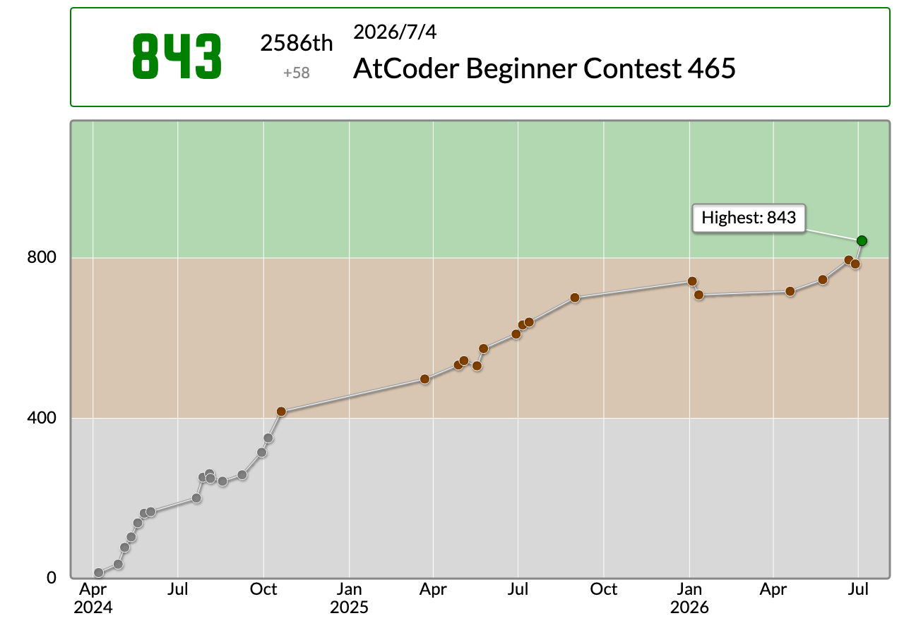

[前回の参加記(ABC464)](https://wcpc.pages.dev/activities/abc464-log/)

## はじめに

おはようございます。Twil3akineといいます。
入緑しました。色変というものは気持ちがいいものです。

とはいえ、入緑で満足するつもりはさらさらなく、コンスタントにレートを上げていかなきゃな、と思ってます。

入水は入緑よりも本当に遠くて、今回初めて水色パフォが出たのですが、現時点ではこれを安定して出せる気がしません。

やはり、水に上がるにはアルゴリズムやデータ構造の理解はもちろん、解ける問題に対してすぐに方針を立て、スムーズに実装できることも必要です。
水コーダーになるには、こういうことが求められると思います。

私は実装が本当に苦手で、今後どのように克服していけるかがポイントかなぁ、と思ってます。

真面目な話は性に合わないので、ここらでおしまいです。

---

## 結果サマリ

- [ABC465](https://atcoder.jp/contests/abc465)
- WCPC参加人数: **7人**
- 各問題の最速解答者(ペナルティなし):

| 問題 | 参加者名    | タイム | 言語 |
| :--- | :---------- | :----- | :--- |
| A    | nsubaru     | 0:23   | Java |
| B    | ShoboiNamae | 3:10   | C++  |
| C    | Twil3       | 15:33  | Rust |
| D    | Twil3       | 46:15  | Rust |
| E    | -           | -      | -    |
| F    | -           | -      | -    |
| G    | -           | -      | -    |

(改めて見ると、このサークルには色々な言語が蔓延っていますね)

---

## 今週の出題

### A問題

問題ページ: [A - Supermajority](https://atcoder.jp/contests/abc465/tasks/abc465_a)

[ABC463 - A](https://atcoder.jp/contests/abc463/tasks/abc463_a) と同じですね。

浮動小数点数を使う必要はありません。$A > B \times \frac{2}{3}$ の両辺を3倍して、`A * 3 > B * 2` を判定すればOKです。

---

### B問題

問題ページ: [B - Parking 2](https://atcoder.jp/contests/abc465/tasks/abc465_b)

ある偉い人は言いました。『$\mathcal{O}(1)$ で賢く解くよりも、$\mathcal{O}(N)$ で確実に解いたほうが良い』と。

各時刻 $i \; (A \le i < B)$ について、$i$ 時から $i+1$ 時までの料金を考えます。

- $L \le i < R$ なら $X$ を加算する
- そうでないなら $Y$ を加算する

この問題では時刻が $23$ 以下なので、1時間ずつ料金を加算するシミュレーションで十分です。

---

### C問題

問題ページ: [C - Reverse Permutation](https://atcoder.jp/contests/abc465/tasks/abc465_c)

こういうアルゴリズムでもデータ構造でもない問題が一番面白いですよね。そうです、サンプルエスパーしましょう。

$k$ の操作を行う直前、$k$ は操作対象の末尾にあります。そのため、操作後の $k$ は次の位置に移動します。

- $S_k$ が `o` なら、先頭へ移動する
- $S_k$ が `x` なら、末尾に残る

そこで、操作を $k=N,N-1,\ldots,1$ の順に読み、答えを外側から埋めていきます。未確定部分の左右端と、向きが反転しているかを持っておけば、$k$ をどちらの端へ置くかが決まります。

- 反転していなければ、`o` なら左端、`x` なら右端へ置く
- 反転していれば、置く側を左右逆にする
- `o` の場合は、置いた後に向きも反転させる

長さ $N$ の配列を先に用意し、左右の書き込み位置を管理しながら埋めれば、Dequeを使わずに $\mathcal{O}(N)$ で実装できます。

---

### D問題

問題ページ: [D - X to Y](https://atcoder.jp/contests/abc465/tasks/abc465_d)

似ているかは置いておいて、類題として [Codeforces 1103 (Div.3) - C: Omsk Programmers](https://codeforces.com/contest/2236/problem/C) を挙げておきます。

この問題の操作は、次の2種類に分けて考えられます。

- 操作1: $x$ を $\left\lfloor \frac{x}{K} \right\rfloor$ に更新する
- 操作2: $x$ を $[x \times K, (x+1) \times K)$ の区間内の整数に更新する

操作1の更新先は一意に決まりますが、操作2には複数の更新先があります。そのため、操作2でどの値を選ぶかを $X$ 側から考えるのは大変です。

ここで、$X$ に操作2を行う代わりに、$Y$ に操作1を行うことを考えます。$X$ から見れば操作2の行き先は複数ありますが、行き先の $Y$ から逆にたどれば $\left\lfloor \frac{Y}{K} \right\rfloor$ に一意に決まります。

したがって、$X \ne Y$ の間は $X, Y$ の大きい方を $K$ で割ればよいです。

$X = 7, \; Y = 43, \; K = 6$ で考えると、$Y$ の方が大きいので、

$$
Y \leftarrow \left\lfloor \frac{43}{6} \right\rfloor = 7
$$

とすれば、1回で $X=Y$ になります。あとは $X=Y$ になるまで、大きい方を $K$ で割り、その回数を数えれば答えです。

私は最初、切り捨てを表現しようとして浮動小数点数を使い、WAを出しました。しかし、$X,Y,K$ は最大 $10^{18}$ なので、浮動小数点数では正確に保持できません。整数除算を使えば、そのまま切り捨てられます。

---

### E問題

問題ページ: [E - Digit Circus](https://atcoder.jp/contests/abc465/tasks/abc465_e)

解けませんでした。

世界のナベアツだなぁと思いつつ、巨大数の問題を解いたことがないので良くわかりません。

コンテスト後にTwitterとかを見ていると、**桁DP** というものを使うらしいです。これを機に勉強しようかなと思います。

---

## 最後に

ついに緑です。

満足せずに頑張ろうと思います。

Twil3akineでした。

あ、みなさんもヒューリスティックしましょうね。
